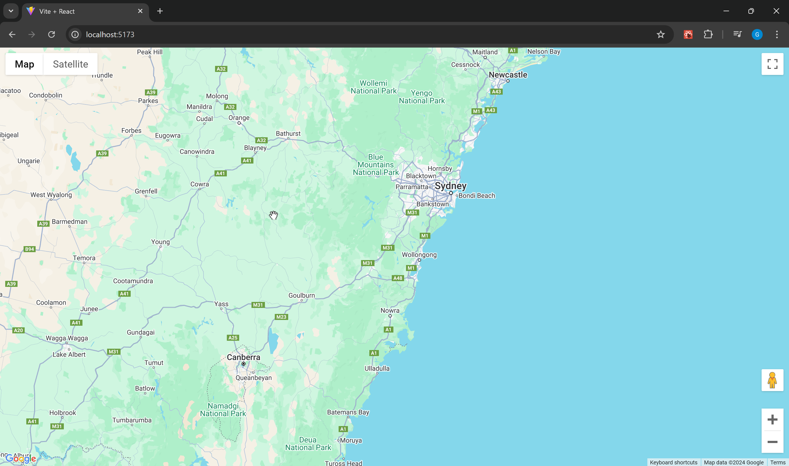
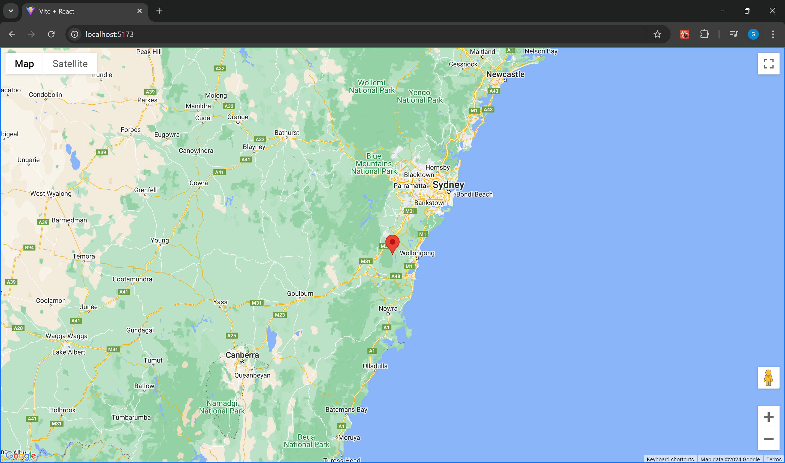
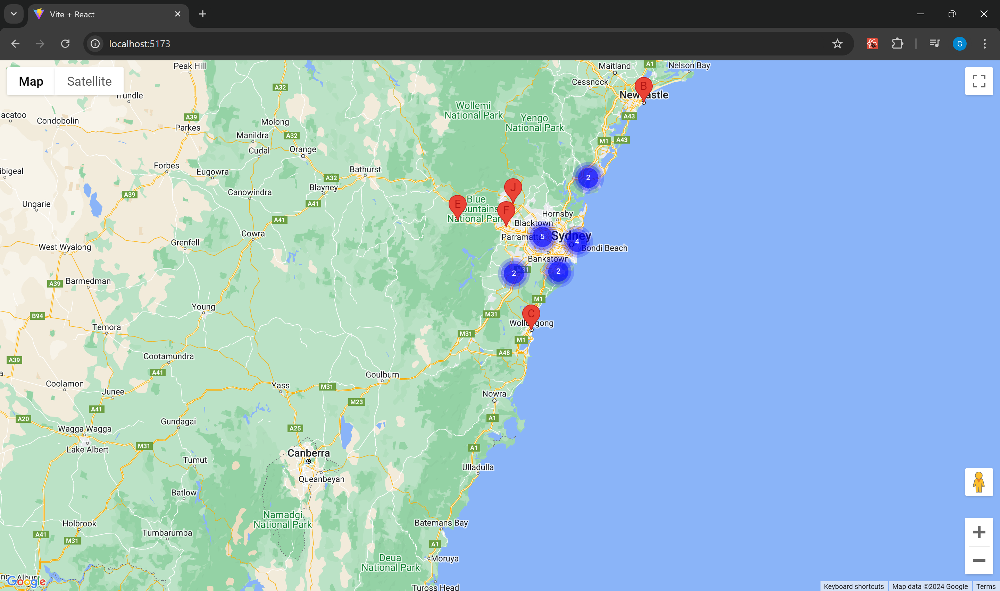
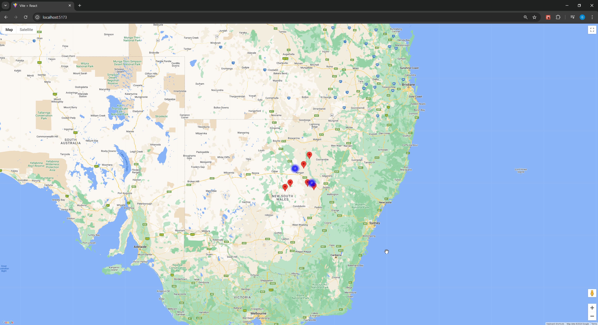

# Laboratorio 5: Georeferenciación y Mapas con React y Google Maps

En este laboratorio revisaremos a grandes rasgos como funciona Google Maps en conjunto con la georeferenciación en nuestro navegador, para ello, desarrollaremos con React y Vite una herramienta para visualizar puntos importantes en un mapa, estos estarán agrupados mediante Clusters, y podrán ser filtrados con un input en la parte superior.

La aplicación a utilizar se compone de 2 partes: un backend con Sinatra (directorio `/backend`), el cual entrega una lista de puntos importantes en un mapa, extraídos desde un archivo JSON, y un frontend con React y Vite (directorio `/frontend`). Este frontend cuenta con un custom hook que trae toda la lógica necesaria para trabajar directamente con las clases de Google Maps.

## Pasos Iniciales

Se debe renombrar el archivo el archivo `.env.example` a `.env`. Posterior a ello, es necesario conseguir una API Key para el uso de Google Maps, esto se gestiona siguiendo los pasos de la siguiente URL: [https://developers.google.com/maps/documentation/javascript/get-api-key](https://developers.google.com/maps/documentation/javascript/get-api-key)

Una vez que se cuenta con la API Key, se deben actualizar los valores del archivo `.env`, indicando la URL del Backend y la API Key:

```bash
VITE_BACKEND_URL=http://localhost:4567
VITE_GOOGLE_MAPS_KEY=exampleKey
```

Luego, instalar las dependencias del frontend con el comando `npm install`, para finalmente ejecutarlo con `npm run dev`. Una vez el frontend esté funcionando, acceder a él mediante la URL `http://localhost:5173`. Por último, para levantar el backend, debes ejecutar `bundle exec ruby app.rb`;

## Marco Teórico

### Google Maps

Google Maps es un servicio de mapas en línea desarrollado por Google. Ofrece imágenes de mapas desplazables, así como fotografías por satélite del mundo e incluso la ruta entre diferentes ubicaciones o imágenes a pie de calle con Google Street View. Además, Google Maps ofrece un API para desarrolladores que permite la integración de sus servicios en aplicaciones web y móviles.

#### Inicialización de Google Maps

Para cargar Google Maps en nuestra aplicación, utlizaremos la librería [@googlemaps/js-api-loader](https://www.npmjs.com/package/@googlemaps/js-api-loader). Esta nos permite instanciar un `Loader` con nuestra API Key, el cual expone el método `importLibrary(name)` que carga en tiempo de ejecución la librería solicitada, retornándola en una promesa.

```javascript
import { Loader } from '@googlemaps/js-api-loader';

const loader = new Loader({
  apiKey: process.env.VITE_GOOGLE_MAPS_KEY,
  version: 'weekly',
});

loader.importLibrary('maps').then((lib) => {
  const { Map } = lib;
  // Código de inicialización de Google Maps
});
```

Una vez que la librería `maps` ha sido cargada, podemos utilizar las clases de Google Maps para crear un mapa. Del mismo modo, si necesitamos otras librerías como `marker`, `clusterer`, `places`, entre otras, podemos cargarlas de la misma forma.

#### Creación de un Mapa

Una vez que cargamos la librería en nuestra aplicación, debemos instanciar la clase `Map` entregándole a su constructor un elemento HTML del DOM, y un objeto de configuración con las opciones del mapa. Dado que estamos trabajando con react, debemos realizar todo esto considerando el ciclo de vida de los componentes, es decir, una vez que el componente esté montado, podemos tomar una referencia a su nodo en el DOM, y entregar este nodo al mapa para montarse.



```javascript
import { Loader } from '@googlemaps/js-api-loader';
import { useEffect, useRef } from 'react';

const MapComponent = () => {
  const mapRef = useRef(null);

  useEffect(() => {
    const loader = new Loader({
      apiKey: import.meta.env.VITE_GOOGLE_MAPS_KEY,
      version: 'weekly',
    });
    loader.importLibrary('maps').then((lib) => {
      const { Map } = lib;
      new Map(mapRef.current, {
        mapId: 'DEMO_MAP_ID',
        center: { lat: -34.397, lng: 150.644 },
        zoom: 8,
      });
    });
  }, []);

  return <div ref={mapRef} style={{ width: '100vw', height: '100vh' }} />;
};

export default MapComponent;
```

En este caso, hacemos uso del hook `useRef`, el cual al ser entregado como propiedad `ref` de un elemento JSX, automáticamente se carga en la propiedad current la referencia al nodo montado en el DOM. De esta forma, podemos entregar este nodo al constructor de `Map`, y este se encargará de montar el mapa en el elemento HTML. Los estilos del div contenedor deben ser configurados para que el mapa ocupe todo el espacio disponible.

El mapa se instancia indicando la latitud y longitud de donde va a estar centrado, y el nivel de zoom que se desea. En este caso, el mapa se centrará en las coordenadas de Sidney, Australia, con un nivel de zoom de 8. Se pueden encontrar el resto de propiedades aquí: https://developers.google.com/maps/documentation/javascript/reference/map#MapOptions

### Creación de un Marker

Para indicar donde se encuentra un elemento relevante del mapa, se utilizan los `Markers`. Estos provienen de la biblioteca `marker` de Google Maps, la cual se puede cargar de la misma forma que la librería `maps`. Una vez que se tiene la librería cargada, se puede instanciar un `AdvancedMarkerElement` entregándole un objeto de configuración con las opciones del marcador. Originalmente esto se hacía con la clase `Marker`, pero esta ha sido descontinuada en favor de `AdvancedMarkerElement`.



```javascript
import { Loader } from '@googlemaps/js-api-loader';
import { useEffect, useRef } from 'react';

const MapComponent = () => {
  const mapRef = useRef(null);

  useEffect(() => {
    const loader = new Loader({
      apiKey: import.meta.env.VITE_GOOGLE_MAPS_KEY,
      version: 'weekly',
    });
    loader
      .importLibrary('maps')
      .then((lib) => {
        const { Map } = lib;
        const map = new Map(mapRef.current, {
          mapId: 'DEMO_MAP_ID',
          center: { lat: -34.397, lng: 150.644 },
          zoom: 8,
        });
        return map;
      })
      .then((map) => {
        loader.importLibrary('marker').then((lib) => {
          const { AdvancedMarkerElement } = lib;
          new AdvancedMarkerElement({
            position: { lat: -34.397, lng: 150.644 },
            map,
          });
        });
      });
  }, []);

  return <div ref={mapRef} style={{ width: '100vw', height: '100vh' }} />;
};

export default MapComponent;
```

En este caso, una vez que se ha cargado la librería `maps`, se instancia un mapa, el cual es retornado en la promesa. Luego, se carga la librería `marker`, y se instancia un marcador en las coordenadas de Sidney, Australia, entregándole el mapa donde se montará. Se pueden encontrar el resto de propiedades aquí: https://developers.google.com/maps/documentation/javascript/reference/advanced-markers#AdvancedMarkerElementOptions

### Clustering de Markers

Dado que colocar muchos markers en lugares cercanos puede generar dificultades para su visualización, debido a que se sobreponen y dan una idea errónea de la cantidad de elementos en un lugar, se pueden agrupar estos markers en clusters. Para ello, se utiliza la librería [`markerclusterer`](https://www.npmjs.com/package/@googlemaps/markerclusterer) de Google Maps, documentada en [https://developers.google.com/maps/documentation/javascript/marker-clustering](https://developers.google.com/maps/documentation/javascript/marker-clustering).



Instalación de la librería:

```bash
npm install @googlemaps/markerclusterer
```

```javascript
import { Loader } from '@googlemaps/js-api-loader';
import { MarkerClusterer } from '@googlemaps/markerclusterer';
import { useEffect, useRef } from 'react';

const cities = [
  { name: 'Sydney', lat: -33.8688, lng: 151.2093 },
  { name: 'Newcastle', lat: -32.9283, lng: 151.7817 },
  { name: 'Wollongong', lat: -34.4278, lng: 150.8931 },
  { name: 'Central Coast', lat: -33.4245, lng: 151.3416 },
  { name: 'Blue Mountains', lat: -33.7127, lng: 150.3119 },
  { name: 'Penrith', lat: -33.7512, lng: 150.693 },
  { name: 'Parramatta', lat: -33.8137, lng: 151.0034 },
  { name: 'Campbelltown', lat: -34.0625, lng: 150.816 },
  { name: 'Gosford', lat: -33.4265, lng: 151.3419 },
  { name: 'Richmond', lat: -33.6006, lng: 150.7506 },

  { name: 'Hornsby', lat: -33.703, lng: 151.0993 },
  { name: 'Blacktown', lat: -33.7734, lng: 150.9084 },
  { name: 'Cronulla', lat: -34.0587, lng: 151.1528 },
  { name: 'Manly', lat: -33.7963, lng: 151.286 },
  { name: 'Bondi Beach', lat: -33.8915, lng: 151.2767 },
  { name: 'Mosman', lat: -33.8277, lng: 151.2398 },
  { name: 'Liverpool', lat: -33.92, lng: 150.924 },
  { name: 'Sutherland', lat: -34.0316, lng: 151.058 },
  { name: 'Camden', lat: -34.0548, lng: 150.6962 },
  { name: 'Fairfield', lat: -33.8685, lng: 150.95 },
];

const labels = 'ABCDEFGHIJKLMNOPQRSTUVWXYZ';

const MapComponent = () => {
  const mapRef = useRef(null);

  useEffect(() => {
    const loader = new Loader({
      apiKey: import.meta.env.VITE_GOOGLE_MAPS_KEY,
      version: 'weekly',
    });
    loader
      .importLibrary('maps')
      .then((lib) => {
        const { Map } = lib;
        const map = new Map(mapRef.current, {
          mapId: 'DEMO_MAP_ID',
          center: { lat: -34.397, lng: 150.644 },
          zoom: 8,
        });
        return map;
      })
      .then((map) => {
        loader.importLibrary('marker').then((lib) => {
          const { AdvancedMarkerElement, PinElement } = lib;
          const markers = cities.map(({ lat, lng }, i) => {
            const label = labels[i % labels.length];
            const pin = new PinElement({ glyph: label });
            const position = { lat, lng };
            return new AdvancedMarkerElement({
              position,
              content: pin.element,
            });
          });

          new MarkerClusterer({ map, markers });
        });
      });
  }, []);

  return <div ref={mapRef} style={{ width: '100vw', height: '100vh' }} />;
};

export default MapComponent;
```

En este caso, una vez montado el mapa, y cargada la librería marker, se crean una serie de markers junto con su respectivo `PinElement` según la lista `cities`, y se agrupan en un `MarkerClusterer` que se monta en el mapa. Se pueden encontrar las propiedades de los `PinElement` aquí: [https://developers.google.com/maps/documentation/javascript/reference/advanced-markers#PinElement](https://developers.google.com/maps/documentation/javascript/reference/advanced-markers#PinElement)

### Ciclo de Vida de un Componente

En React, los componentes tienen un ciclo de vida que se compone de 3 fases: montaje, actualización y desmontaje. Para manipularlos se utilizan hooks, los cuales permiten mantener valores durante las actualizaciones de los componentes (como `useState` y `useRef`), o ejecutar código en ciertos momentos del ciclo de vida (como `useEffect`).

El hook `useState` nos retorna un `estado` y un `modificador`, esto es sumamente beneficioso ya que nos permite `escuchar` cambios en el estado, así como también, `gatillar` nuetras propias modificaciones al mismo, lo que se traduce en volver a renderizar el componente. A diferencia de este hook, `useRef` nos permite mantener una referencia a algún valor, sin que esto provoque una nueva renderización del componente. Por lo general, `useRef` se utiliza para mantener la referencia de un elemento del DOM, pero en este caso, se utiliza para mantener la referencia de un objeto que se crea en el ciclo de vida del componente.

Por otro lado, `useEffect` es un hook que nos permite ejecutar código en ciertos momentos del ciclo de vida del componente. Este hook recibe una función que se ejecutará en el momento que se le indique, y un arreglo de dependencias que, si se encuentra vacío, se ejecutará solo una vez al montar el componente. Si se encuentra con dependencias, se ejecutará cada vez que alguna de estas cambie. Por lo general es útil dejar como dependencia un estado, ya que al cambiar este, se ejecutará el código dentro del `useEffect`.

### Custom Hooks

Los custom hooks son una forma de extraer lógica de un componente y reutilizarla en otros componentes. Estos son funciones que pueden utilizar hooks de React, y que retornan valores que pueden ser utilizados en otros componentes. Más adelante verás que se ha creado un custom hook que se encarga de cargar la librería de Google Maps, y de instanciar las clases necesarias para trabajar con el mapa.

## Descripción de la Aplicación en React



En la carpeta `frontend` se encuentra una aplicación que muestra un mapa con centro en Sidney, Australia, y una serie de marcadores que representan ciudades aledañas. Estos marcadores están agrupados en un cluster, y se generan aleatoriamente por lo que recargar la página muestra otra organización de los mismos.

Para efectos del laboratorio, se ha creado un custom hook que se encarga de cargar la librería de Google Maps, y de instanciar las clases necesarias para trabajar con el mapa. Este custom hook se encuentra en el archivo `src/hooks/useLoadGMapsLibraries.js`, y expone un estado interno el cual gatilla una renderización del componente una vez que todo ha cargado.

```javascript
import { useEffect, useState } from 'react';
import { Loader } from '@googlemaps/js-api-loader';
import { GOOGLE_MAPS_LIBRARIES } from '../constants';

export const useLoadGMapsLibraries = () => {
  const [libraries, setLibraries] = useState();

  useEffect(() => {
    const loader = new Loader({
      apiKey: import.meta.env.VITE_GOOGLE_MAPS_API_KEY,
      version: 'weekly',
    });

    const promises = GOOGLE_MAPS_LIBRARIES.map((name) =>
      loader.importLibrary(name).then((lib) => [name, lib])
    );

    Promise.all(promises).then((libs) =>
      setLibraries(Object.fromEntries(libs))
    );
  }, []);

  return libraries;
};
```

Cuando se invoca el custom hook, este genera un estado donde se almacenan las librerías de Google Maps, el cual parte por defecto como `undefined` (esto le permite al componente que lo utilice, saber si las librerías han sido cargadas o no, y mostrar algún mensaje al respecto). Una vez que se monta el componente, con la ayuda del hook `useEffect`, se instancia un `Loader` de Google Maps, y se importan las librerías necesarias generando un arreglo de promesas las cuales luego convergen en un único `Promise.all()`. Las promesas retornan intencionalmente las librerías bajo la estructura `[name, lib]`, para luego convertirlas en un objeto con `Object.fromEntries(libs)` y finalmente almacenarlas en el estado `libraries` gatillando 1 sólo cambio de estado, independiente de la cantidad de librerías que se quieran añadir.

De este custom hook es posible extraer los módulos necesarios para instanciar Mapas, Markers, entre otros, a su vez, carga en el objeto `window` la propiedad `google` utilizada por `@googlemaps/markerclusterer`, por lo que una vez que `libraries` deja de ser `undefined`, es posible instanciar un Cluster de Markers.

El resto de la aplicación se basa en hacer uso de este custom hook para renderizar un mapa, y guardar las instancias creadas en distintas instancias de `useRef`, para así conservar su valor durante las actualizaciones del componente.

## Descripción de la Aplicación de Backend

Un simple servidor en base a Sinatra, con un único endpoint `/markers`, el cual retorna una lista de 100 objetos de la forma `{name: string, lat: number, lng: number}`. Estos objetos representan ciudades y pueden ser utilizados como marcadores para mostrarse en el frontend.

## Experimenta con el Código

1. Modifica las propiedades de los constructores utilizados, como el centro del mapa, el nivel de zoom, las coordenadas de los marcadores, entre otros, para ver cómo cambia la visualización del mapa. Revisa la documentación mencionada previamente en este documento para ver qué más se puede añadir
2. Estiliza los marcadores utilizando instancias de `PinElement`, y modifica las propiedades de estos para ver cómo cambia su apariencia. También puedes probar a cambiar el contenido de los marcadores, o a añadir eventos a los mismos. Revisa la documentación mencionada previamente en este documento para ver qué más se puede añadir, pon especial énfasis en la clase `InfoWindow` y sus eventos.
3. Implementa un estado en el componente llamado `locations`, el cual almacene un arreglo de objetos con las propiedades `name`, `lat` y `lng`. Este estado debe ser inicializado con datos generados por ti (puedes apoyarte en herramientas de IA para esta tarea). Luego, modifica el componente para que los marcadores se generen a partir de este estado, y no de los marcadores generados aleatoriamente.
4. Añade un input al mapa manipulando los arreglos de la propiedad `controls` ([ver documentación](https://developers.google.com/maps/documentation/javascript/controls#Adding_Controls_to_the_Map)). Como sugerencia, se recomienda renderizar el input de antemano como parte del componente, guardar su referencia en una instancia de `useRef`, y luego añadirlo al mapa una vez que este ha sido montado.
5. Filtrar por nombre los marcadores en el mapa, para ello, modifica el estado de `locations` durante los eventos de `onChange` del input, luego utilizando un `useEffect`, limpia los marcadores del cluster guardado en una instancia de `useRef`, y vuelve a crearlos basándote en los objetos restantes de `locations`
6. Revisa la documentación de (https://developer.mozilla.org/en-US/docs/Web/API/Geolocation_API)[https://developer.mozilla.org/en-US/docs/Web/API/Geolocation_API], y añade un marcador con tu localización actual en el mapa.
7. Implementa una solicitud HTTP en el frontend, que consulte el endpoint `/markers`, y carga todos los marcadores en el mapa.

- Nota: por algún motivo, no se cargan los valores de `ControlPosition` desde el método `importLibrary`, por lo que a continuación dejo los valores hardcodeados para su uso (extraídos del objeto `window.google`), será útil para el paso 4.

```javascript
{
    "TOP_LEFT": 1,
    "TOP_CENTER": 2,
    "TOP": 2,
    "TOP_RIGHT": 3,
    "LEFT_CENTER": 4,
    "LEFT_TOP": 5,
    "LEFT": 5,
    "LEFT_BOTTOM": 6,
    "RIGHT_TOP": 7,
    "RIGHT": 7,
    "RIGHT_CENTER": 8,
    "RIGHT_BOTTOM": 9,
    "BOTTOM_LEFT": 10,
    "BOTTOM_CENTER": 11,
    "BOTTOM": 11,
    "BOTTOM_RIGHT": 12,
    "CENTER": 13,
    "BLOCK_START_INLINE_START": 14,
    "BLOCK_START_INLINE_CENTER": 15,
    "BLOCK_START_INLINE_END": 16,
    "INLINE_START_BLOCK_CENTER": 17,
    "INLINE_START_BLOCK_START": 18,
    "INLINE_START_BLOCK_END": 19,
    "INLINE_END_BLOCK_START": 20,
    "INLINE_END_BLOCK_CENTER": 21,
    "INLINE_END_BLOCK_END": 22,
    "BLOCK_END_INLINE_START": 23,
    "BLOCK_END_INLINE_CENTER": 24,
    "BLOCK_END_INLINE_END": 25
}
```
